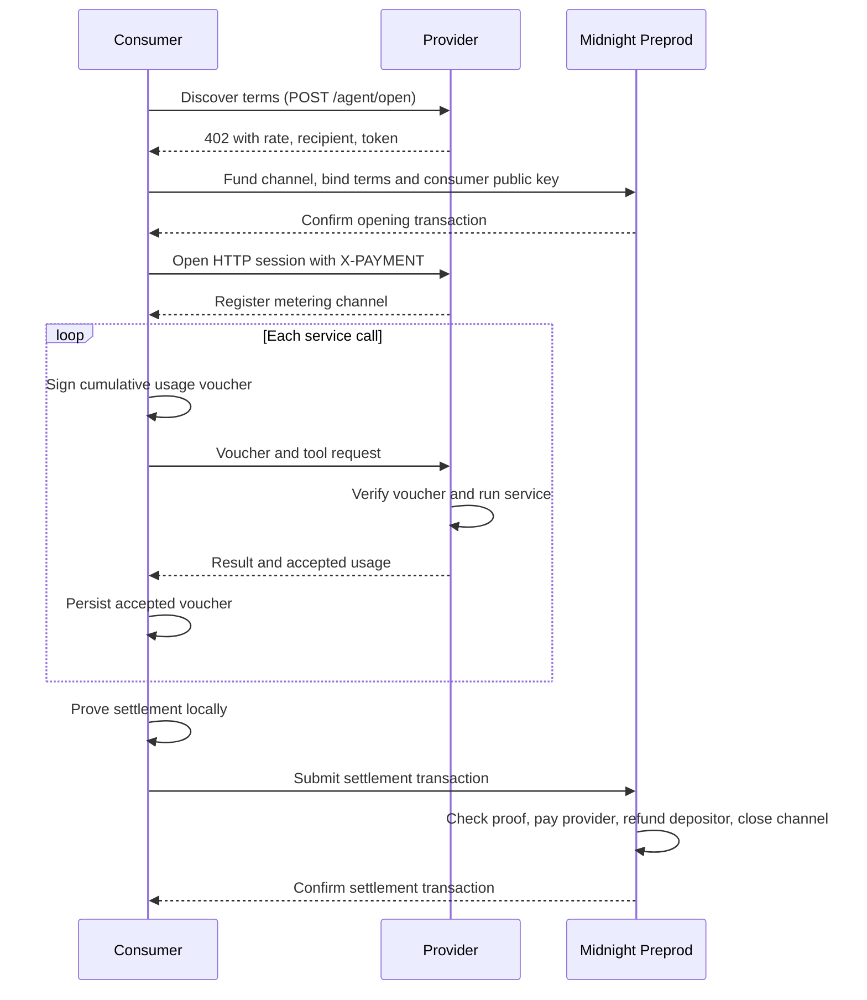

# Avtar.ai — Midnight Agent Marketplace

Avtar.ai is a prototype for metered agent services with zero-knowledge settlement
on Midnight. A consumer buys weather, crypto-price, and translation calls from a
provider, signs cumulative usage vouchers, and settles the session through the
`avtar-escrow` Compact contract.

The HTTP demo supports public Preprod with a local proof server. A separate local
simulation runs the compiled circuit against an in-memory ledger.

## Architecture



The provider calls Open-Meteo, CoinGecko, and MyMemory through HTTP adapters. The
consumer uses either a built-in keyword router or OpenAI for tool selection.
All three tools share one escrow channel and one configured payment recipient.
Tool labels in the response do not represent separate on-chain recipients.

| Component | Responsibility |
| --- | --- |
| `packages/agent-core` | Consumer/provider meters, voucher transport, SQLite recovery state, local and live chain clients |
| `packages/proving-setup` | Schnorr-over-Jubjub voucher signing and Compact-compatible hashing |
| `packages/onchain-setup` | Compact contract, compiled assets, wallet/provider adapters, deployment and recovery scripts |
| `agents/provider` | HTTP 402 discovery, voucher verification, and service API calls |
| `agents/consumer` | Tool selection, escrow funding, persisted metering, and settlement |

## Settlement and Privacy

The consumer signs `transientHash(channelId, totalUnits)`. The contract verifies
the Schnorr-over-Jubjub signature, the rate commitment, the channel's recorded
escrow amount, and `totalUnits × rate ≤ escrow`. It pays the provider, refunds the
remainder, records a nullifier, and sets `closed = true`. The closed-channel guard
rejects repeat settlement even if the caller supplies a different channel secret.

The rate commitment is `persistentHash(rate, rateBlind)` and the nullifier is
`persistentHash(channelId, channelSecret)`. These are the Compact runtime APIs used
by both the TypeScript code and the contract.

| Data | Visibility in this implementation |
| --- | --- |
| Channel ID, consumer public key, depositor, provider, token, escrow, commitment, closure status | Public contract state |
| Settlement amount, refund amount, recipient addresses, nullifier | Public on-chain |
| Rate and cumulative usage | Known to the consumer and provider; rate is also advertised in HTTP discovery |
| Rate blind, channel secret, consumer signing key | Held by the consumer; recovery material is stored in its local SQLite database |
| Tool requests and responses | Off-chain, visible to the agents and relevant service API |

Rate and usage are not explicitly disclosed as ledger fields by `settle`, but the
public payout and advertised rate can reveal total usage. This demo does not hide
payment amounts or guarantee usage privacy. Schnorr signatures authenticate
vouchers; the Compact proof establishes the settlement circuit's execution.

### Prototype Limitations

- The current HTTP authorization verifier accepts any nonempty `X-PAYMENT` header.
  The provided consumer funds a real channel, but the provider does not independently
  verify that funding on-chain before serving. This is an x402-style demo transport,
  not a verified facilitator payment integration.
- The exported `refund(depositor, token)` circuit refunds the pooled balance for
  that pair without closing its channels or checking caller authorization. It can
  invalidate outstanding settlement obligations; the normal demo uses `settle`
  for channel-specific refunds.
- The provider keeps its meter registry in memory. The consumer persists recovery
  material, including its channel signing key, in SQLite. Keep that database private.

## Quick Start

Run all commands from the repository root (`Avtar.ai`). Use Node.js 25.8.1
(the version tested here), pnpm 10.12.1, and the Midnight Compact compiler. Live Preprod
also requires Docker, a funded depositor wallet, and a deployed contract.

### Build

```bash
pnpm install
pnpm --filter @avtar/onchain-setup compact:build
pnpm build
```

For an already installed and compiled checkout, run only `pnpm build`.

### Live Preprod HTTP Demo

This flow opens and settles a channel on the public Preprod testnet. Only contract
proving runs locally. The provider receives payment at its configured address;
unused escrow returns to the depositor. They can be different wallets.

**1. Configure the shared environment.** Both HTTP servers load the repository-root
`.env`, then `packages/onchain-setup/.env` for missing values. Shell variables take
precedence. Keep the existing configured file; on a fresh checkout, copy
`packages/onchain-setup/.example.env` to `packages/onchain-setup/.env` and fill in:

```dotenv
MIDNIGHT_NETWORK_ID=preprod
MIDNIGHT_LOCAL_SIM=false
MIDNIGHT_INDEXER_URL=https://api-preprod.1am.xyz/api/v4/graphql
MIDNIGHT_INDEXER_WS_URL=wss://api-preprod.1am.xyz/api/v4/graphql/ws
MIDNIGHT_NODE_URL=https://api-preprod.1am.xyz/rpc/midnight
MIDNIGHT_PROOF_SERVER_URL=http://127.0.0.1:6300
MIDNIGHT_FEE_SPONSOR_URL=https://api-preprod.1am.xyz
MIDNIGHT_WALLET_SEED=<depositor wallet seed or mnemonic>
MIDNIGHT_AVTAR_ESCROW_ADDRESS=<deployed contract address>
MIDNIGHT_DEPOSITOR_ADDRESS=<depositor's 64-character hex address payload>
MIDNIGHT_PROVIDER_ADDRESS=<provider's 64-character hex address payload>
MIDNIGHT_TOKEN_ADDRESS=<64-character tNIGHT token type>
MIDNIGHT_RATE_ATOMIC=100
MIDNIGHT_TOKEN_SYMBOL=tNIGHT
```

Address settings take decoded 32-byte hexadecimal payloads, not `mn_addr_preprod…`
strings. The depositor must match the funding wallet. The provider needs only a
public receiving address. Keep wallet seeds private and never commit `.env`.
1AM authentication signs a wallet challenge automatically; no 1AM API key is needed.
See [deployment and wallet setup](packages/onchain-setup/midnight/README.md) if you
still need to deploy. An existing deployment does not need redeploying to change
the provider for new channels.

**2. Start the local proof server.** For the existing container:

```bash
docker start avtar-midnight-proof-server
```

On a fresh checkout, create it once instead:

```bash
docker run -d --name avtar-midnight-proof-server -p 127.0.0.1:6300:6300 midnightntwrk/proof-server:8.1.0
```

**3. Terminal 1 — start the provider:**

```bash
MIDNIGHT_LOCAL_SIM=false MIDNIGHT_RATE_ATOMIC=100 pnpm --filter @avtar/agent-provider serve
```

It listens on `http://localhost:4021` and advertises `midnight:preprod`.

**4. Terminal 2 — start the consumer:**

```bash
OPENAI_API_KEY= MIDNIGHT_LOCAL_SIM=false MIDNIGHT_RATE_ATOMIC=100 MIDNIGHT_ESCROW_ATOMIC=1000 \
pnpm --filter @avtar/agent-consumer serve
```

Startup funds a channel with **1,000 atomic tNIGHT**. Wait until it prints
`listening on http://localhost:4022`; wallet sync, proving, and confirmation take
time. An empty OpenAI key selects the built-in demo agent; service APIs still
require internet access. Starting the server does not run tool calls or settle.

**5. Terminal 3 — call the services:**

```bash
curl -sS http://localhost:4022/chat \
  -H 'Content-Type: application/json' \
  -d '{"message":"What is the weather in Tokyo, the price of ETH in USD, and translate good morning into Japanese?"}'
```

**6. Settle the channel:**

```bash
curl -sS -X POST http://localhost:4022/settle
```

Three successful calls at 100 atomic units each pay **300 atomic tNIGHT** to the
provider and refund **700** to the depositor. Check that the settlement response has `settled: true` and a `settleTx`
containing the confirmed transaction ID; `ok: true` alone does not mean settlement
succeeded. Actual service results depend on the external APIs.

If 1AM reports `429` or a pending sponsorship transaction, keep the consumer
running, wait 60 seconds, and retry only `/settle`. Do not open another channel to
retry settlement. If the process has exited, retain its metering database and use
the [settlement recovery command](packages/onchain-setup/midnight/README.md).
With these root-directory commands, the default database is `artifacts/metering.db`;
`METER_DB_PATH` overrides it.
Restart both servers after changing their environment settings.

### Local Simulation

For a single-process demo using the compiled circuit and an in-memory ledger:

```bash
OPENAI_API_KEY= MIDNIGHT_LOCAL_SIM=true pnpm --filter @avtar/agent-consumer demo \
  "Weather in Tokyo, ETH price in USD, translate good morning into Japanese"
```

This runs the provider tools in-process; it does not start the HTTP servers. It
needs no wallet or blockchain connection, but the service APIs use the internet.

## Testing

Run the contract and wallet adapter checks after building:

```bash
pnpm --filter @avtar/onchain-setup test
```

For the live HTTP demo with your configured provider, use the steps above.
`pnpm --filter @avtar/onchain-setup midnight:live-check` is a separate funded
Preprod integration check: it deliberately overrides the provider to the depositor's
own address and therefore does not test payment to your separate provider wallet.
It also requires `packages/onchain-setup/.midnight/preprod/deployment.json` from a
previous deployment.

## Buildathon

Built for Midnight Buildathon Wave 1. The official schedule lists the first build
window as **August 27–September 16**, with a **$3,500** allocation.
See the [Midnight schedule](https://midnight.network/hackathon/buildathon) and
[Akindo event](https://app.akindo.io/wave-hacks/jaMZjqPOBsLXvjdG) for submission
requirements and deadlines. Successful local checks do not constitute a submitted
entry; the demo video, deck, and submission must be published separately.

## Project Structure

```text
Avtar.ai/
├── packages/
│   ├── agent-core/src/
│   │   ├── channel.ts          # Consumer and provider metering
│   │   ├── x402-channel.ts     # HTTP voucher transport
│   │   ├── voucher-wire.ts     # Voucher serialization
│   │   ├── db.ts               # SQLite recovery state
│   │   ├── chain.ts            # Local simulation
│   │   └── live-chain.ts       # Confirmed Midnight transactions
│   ├── proving-setup/src/midnight.ts  # Signing and hashing
│   └── onchain-setup/
│       ├── src/               # Wallet and network adapters
│       └── midnight/
│           ├── contracts/avtar-escrow/src/avtar-escrow.compact
│           ├── deploy.mjs
│           ├── selfcheck.mjs
│           ├── wallet-selfcheck.mjs
│           ├── live-selfcheck.mjs
│           └── recover-settlement.mjs
├── agents/
│   ├── provider/src/          # HTTP server and real service adapters
│   └── consumer/src/          # HTTP server, agent, and CLI demos
└── README.md
```

## Amounts and Addresses

The app performs payment arithmetic with integer atomic units using `bigint`.
A rate of `100` means 100 atomic units per metered call. Token display decimals
are separate from this integer accounting.

Wallets display Preprod unshielded addresses as `mn_addr_preprod…`; the contract
and app configuration use their decoded 32-byte payloads encoded as 64 hex
characters. The settlement token setting is a token type, not a wallet address.

## License

[Apache License 2.0](LICENSE)

## Links

- [Midnight Buildathon](https://app.akindo.io/wave-hacks/jaMZjqPOBsLXvjdG)
- [Deployment and recovery](packages/onchain-setup/midnight/README.md)
- [Midnight](https://midnight.network)
- [x402](https://x402.org)
